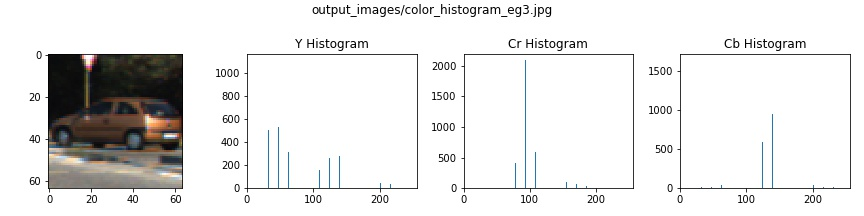
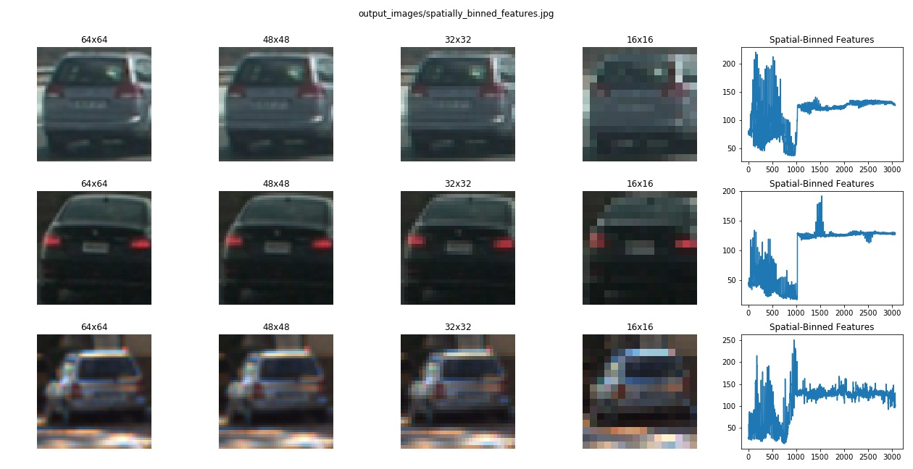
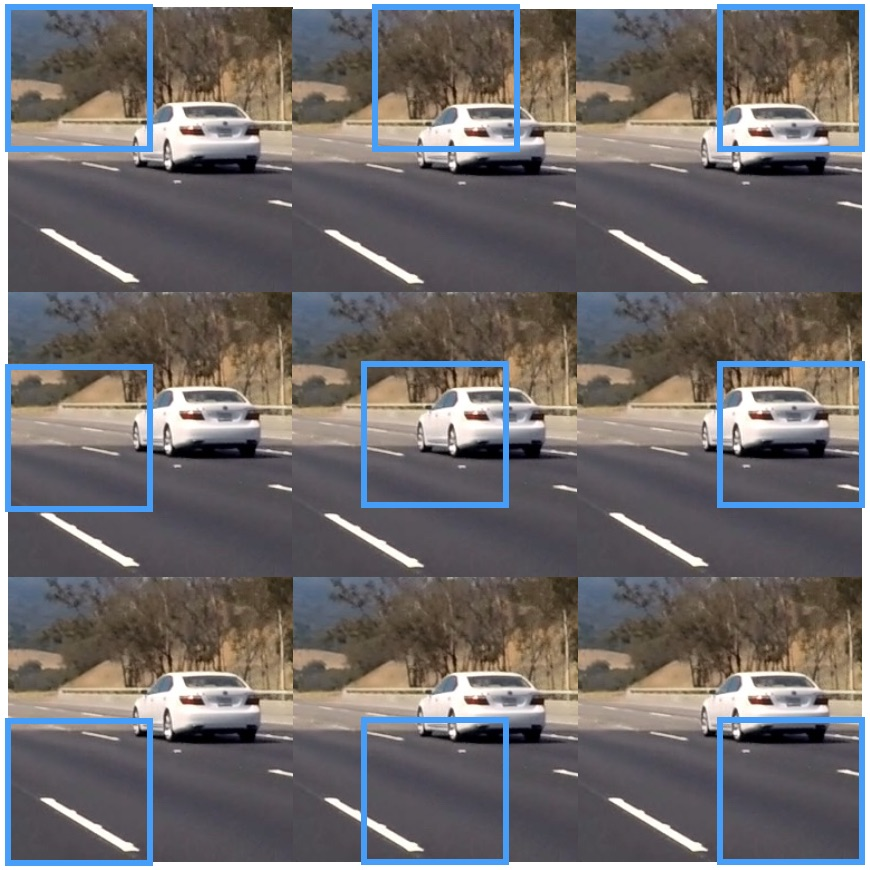

# Vehicle Detection and Tracking
---
*Term 1, Project 5 of Udacity Self-Driving Car Nanodegree, by vuiseng9, Sept 2017*

> 

The goals of this project is to devise a software pipeline to detect and track vehicle(s) from a front-facing camera of a vehicle. The development of pipeline involves:
1. Feature explorations with Histogram of Oriented Gradient (HOG), color space transform, color histrogram and spatial binning of raw pixels
2. Building a Linear SVM Classifier through search of optimal parameters/features
3. Sliding window search on a video frame to detect presence of vehicles
4. Implementation of heatmap to suppress false positives and consolidate duplicate detections

> [Complete codes in Jupyter notebook](https://github.com/vuiseng9/SDCND-P005-Vehicle-Detection/blob/master/Vehicle_Detection_and_Tracking.ipynb)

> [Final Project Video](https://youtu.be/ktw-eh677gE)

> [Joint Vehicle & Lane Detection!](https://youtu.be/S4fIeSmGAj8) 

Following sections explain the stages of pipeline and design considerations to address the project specifications. It is important to note that the code snippets included in this writeup is not explicit as only the essential codes are presented to convey the key ideas. Please refer the ipynb for complete codes.

## Dataset
Referenced through the project suite, the dataset used in this project are comprised of images taken from the [GTI vehicle image database](http://www.gti.ssr.upm.es/data/Vehicle_database.html) and [KITTI vision benchmark suite](http://www.cvlibs.net/datasets/kitti/). The dataset is considered balanced as there are **8792 images of vehicles**, mostly from rear view, and **8968 non-vehicle images** such as lane lines, lane dividers, trees and etc. All images are in the 64x64 RGB png format. Following is a random visualization from the dataset.

> 

## Feature Exploration
In order for classifier to be effectively decipher between vehicle and non-vehicke images, we need to select features that can generalize to more scenarios and yet have discreminating power. We will look into few types of feature extraction method below.

### Color Histogram
As introduced in the lecture, color histogram is an aggregation of object color, it can be an accurate representation of a vehicle and a non-vehicle when the right bin size is used. It is a good feature as it is invariant to the changes of vehicle appearance to a certain extent, such as cases of different orientation of the vehicle and some variance in lighting conditions. In other words, the distribution of color histogram is similar in these situations and a classifier could form a separable decision boundardaries based on these histograms. Using ```color_hist``` developed during the tutorial, following are few plots of color histogram with bin size of 16 in YCrCb color space. As for which color space to operate and what bin size to use, we will perform search in these parameter spaces in the training section.




### Spatial Binning
Template matching of raw pixel may not be really helpful as it is down to detailed and specific pixel value and order. However, consider the images below where raw image is resized to multiple smaller size,



here we can still identify visually a vehicle even the image is resized down to 16x16pixel. This means some relevant information are still preserved. With this assumption, a classifier could potentially leverage these pixel values as feature to differentiate a vehicle. Personally, the intuition is that the tail lights would appear in certain region of an image and they are in red by standard worldwide, this would serve as an indicator of rear view of a vehicle. Spatial binning can abstract these regions. 

In short, spatial binning is basically subsampling a full resolution to a lower resolution and taking its individual values as features. Hey that seems familiar, doesn't it? It is very much the average pooling layer in deep learning where each region of the raw image is down-sampled by averaging. The  ```bin_spatial``` function from tutorial has been utilized for this project. 

### Histogram of Oriented Gradient
Thus far, we are only looking at the color-based features, shape will be an important feature to signify an object. This is where HOG comes in, Histogram of Oriented Gradient. HOG is a popular conventional features often applied in computer vision, it is able to represent the structure of an object and also allow variation in shape. 
> Illustration adapted from tutorial to visualize HOG terms: block, cell
> 

Before examining into example of HOG output, let's briefly talk about steps to obtain HOG features. The first step is to apply a Sobel operator on the raw image to obtain gradient magnitude and orientation for each pixel. The image is then divided into regions, also known as blocks, whether these regions are overlapping or non-overlapping, it is up to application. Each block is further broken down into cells. For each cell, a histogram is computed where gradient orientation is binned and gradient magnitude of each pixel contributes to its corresponding orientation bin total. Like color histogram, each bin of the histogram serve as a single feature for classifier. From examples below, clearly, structure or shape of objects are well represented with HOG.
> 
> Notice that HOG intensity is high on dominant edges and edges form the shape of the object in the image.
In this project, we wrap the ```skimage.feature.hog``` function as ```extract_hog_features``` to extract the HOG features for each channel of the input image.


## Building a Linear SVM Vehicle Classifier
Equipped with the feature extractions above, we are ready to train a classifier. The choice of the algorithm is **Support Vector Machine**. The **linear** variant of SVM is chosen, simply because turnaround time to iterate the training is shorter than other compute-intensive kernelized SVM on my laptop. Also in practice, real-time processing is a key requirement where the latency of a pipeline needs to be short enough to detect and derive action on the auto-driving vehicle. ```sklearn.svm.LinearSVC``` is used. Note that ```svm.SVC(kernel="linear)``` is not equivalent to ```svm.LinearSVC``` by default. ```svm.SVC(kernel="linear")``` is so much slower compared to ```svm.LinearSVC```.

**Feature normalization** is applied to all features to standardize its significance to the classifier and to avoid large magnitude features taking precedence as main predictors. Using ```sklearn.preprocessing.StandardScaler```, features are scaled to zero mean and unit variance.

**Choice of features** - It would be ideal to perform exhaustive search for the optimum combination of features that gives the best accuracy. However, with limited compute resource and long turnaround time, we would go with all the features introduced in the lecture and we establish a few assumptions and search for sub-optimal-but-good-enough parameters for feature extractions. 

We start by the search of color space to operate. Here we only use HOG features with fixed parameters so that the only variable in the search is color space. We perform loops of training and validation with different color spaces, i.e. RGB, HSV, LUV, YUV & YCrCb. **K-fold Stratified Cross Validation** is applied to get an average of model accuracy. **3 folds** are used and stratification is to get balanced examples of each class in each fold. From the tabulated result below, **YCrCb** is decided to be the color space for our classifer since it gives the best average accuracy.

| acc_fold_0 | acc_fold_1 | acc_fold_2 | acc_mean | color_space | elapsed | 
|------------|------------|------------|----------|-------------|---------| 
| 0.987      | 0.9905     | 0.9885     | **0.9887**| **YCrCb**  | 97.239  | 
| 0.9865     | 0.9887     | 0.9877     | 0.9876   | YUV         | 88.97   | 
| 0.9845     | 0.9868     | 0.9865     | 0.9859   | LUV         | 96.536  | 
| 0.9856     | 0.9861     | 0.985      | 0.9856   | HSV         | 100.611 | 
| 0.9672     | 0.9654     | 0.9662     | 0.9663   | RGB         | 116.049 | 

Next is to search for optimal parameters for bin size of color histogram, resolution of spatial binning and HOG parameters. Due to limited memory, these are the allowed search space. Also note that **HOG pixels per cell and cells per block are fixed 8 and 2**.
```
spatial_size_list = [(16,16)]
hist_bin_list = [16,32]
hog_orient_list= [8,9,10,11]
```
The same 3-fold cross validation is applied in this search. From the result below, we have a tie in the top spot, both top candidates give a mean of 99.37% of accuracy. The decision goes to one with lower bin size of color histogram as it gives lesser false positives in the final inference on project video. The final choice of parameters for feature extraction is **16 bins of color histogram, 16 by 16 of spatial bins and 11 HOG orientation bins**.

| acc_fold_0 | acc_fold_1 | acc_fold_2 | acc_mean | color_space | elapsed | hist_bins | hog_orient | spatial_size |
|------------|------------|------------|----------|-------------|---------|-----------|------------|--------------|
| 0.9927     | 0.9946     | 0.9937     | *0.9937* | *YCrCb*     | *81.173*|*32*       |*11*        |*(16, 16)*    |
| 0.9927     | 0.9949     | 0.9934     | *0.9937* | **YCrCb**   | **88.792** | **16** |**11**      |**(16, 16)**  |
| 0.9927     | 0.9946     | 0.9931     | 0.9935   | YCrCb       | 79.008  | 32        | 10         | (16, 16)     |
| 0.9924     | 0.9946     | 0.9926     | 0.9932   | YCrCb       | 94.828  | 32        | 8          | (16, 16)     |
| 0.9926     | 0.9949     | 0.9921     | 0.9932   | YCrCb       | 92.852  | 16        | 8          | (16, 16)     |
| 0.9924     | 0.9946     | 0.9924     | 0.9931   | YCrCb       | 78.674  | 16        | 10         | (16, 16)     |
| 0.9916     | 0.9944     | 0.9932     | 0.9931   | YCrCb       | 87.456  | 32        | 9          | (16, 16)     |
| 0.9917     | 0.9946     | 0.9927     | 0.993    | YCrCb       | 85.619  | 16        | 9          | (16, 16)     |

A gridsearch on the hyperparameters of the linear SVC is attempted and there seems to be no effect of changing the C parameter in the linearSVC function. Further debug required, please refer ipynb for more details. We will just stick with the default hyperparameters. 

**Final Model Training** - With the final selection of parameters, a final linear SVC is trained with **train-test split of ratio 8:2**. The test accuracy is **99.17%**. Examples of prediction:
>  

## Sliding Window Search
Now we have a classifier to determine if an image contains a vehicle or not. The next is to use it to detect the vehicle in the front-facing video frame. Sliding window search is implemented here where an input image is divided into overlapping candidates subwindows. Each candidate will be predicted by the classifier to detect vehicle. Visually, it is something like the image below.

> Sliding window visualization adapted from tutorials
> 

Now the question is what window sizes we need? The intuition for vehicle detection on a front-facing camera is that the input view is a single vanishing perspective, that means the closer an object to the camera, the larger it is. Therefore, we need multi-scale candidate subwindows to detect vehicles from different distances. A function ```plot_sliding_window``` has been created, an adaptation of function learned in tutorial, to obtain right region of interest (ROI) to detect vehicles from different distances. Following are the final scales and ROIs
```python
    # list element (scale, ystart, ystop)
    search_scale = [(1.0, 380, 540),
                    (1.5, 380, 580),
                    (2.0, 380, 640),
                    (2.5, 380, 720)]
```
> Visualization of search scale and ROI - notice that large scale windows cover close-by vehicle while small scale windows are meant for vehicle from far
> 

To perform sliding window search, ```slide_extract_classify``` function is adapted and modified slightly from the tutorial ```find_cars``` function. The function slides through the input image on the specified ROI, then extracts features for each window and subsequently predicts if it is a window of vehicle. In contrast to color histogram and spatial-binned features, HOG features is only computed once per ROI. HOG of subwindow candidates is resized and subsampled from the cache values to avoid recomputation of the overlapped HOG region. Finally, the function returns a list of bboxes of the vehicle windows. 
```python
   # Signature of the function slide_extract_classify()
   slide_extract_classify(img, ystart, ystop, scale, 
			  color_space, svc, X_scaler, 
                          hog_orient, hog_pix_per_cell, hog_cell_per_block, 
                          spatial_size, hist_bins)
```
> Putting sliding window search on test images
> 


## Overcoming False Positives and Duplicate Detections
From the test image detection above, it is obvious that multiple windows have been triggered positive for each vehicle and there are false positives, eg, in test image 2, a patch on the road is classified as vehicle, it makes sense that lane line confused the classifier as the car edge and also the the color values across the window is quite consistent which that happens to car as well. A heatmap is useful to handle these two issues. Conceptually, all pixels in the positive windows contribute a votes, cumulative votes form a heatmap. This computation is implemented through the ```add_heat``` function. When we look carefully into the heatmap, the heat on  the area of false positives are colder as compared to the true positive, we can suppress/filter this area by thresholding. ```apply_threshold``` performs this suppresion and now we are left with presumably true positive heat, which are not in the rectangle shape. To convert the remaining heat to be window boxes, ```label``` function from ```scipy``` package is handy where it uniquifies connected heat area, meaning disonnected heat zones are labeled with unique identifier. And finally, through the unique identifier, the heat zone bounding boxes can be derived and drawn with the ```draw_labeled_bboxes``` function.
> Example of False Positive Suppresion and Duplicate Detection Consolidation via Heatmap, Thresholding & Connected-Component Labeling
> 

## Video Pipeline

A simplistic pipeline is developed to track the vehicles and to stabilize the bounding boxes around the vehicles. The thresholding is applied here again. 
```python
    # List variable to store historical heatmap
    heatmap_history = []
    
    # Number of historical heatmap to store
    nhis = 5
```
We store a series of historical thresholded heatmaps, summing them up and then applying another thresholding, this essentially furthur suppresses some area of the detected windows that are not consistent in a series of frames. In this way, we could achieve a better stabilized detection and also a simple form of tracking.
```python
        # Initialize heapmap of current frame
        curr_heat = np.zeros_like(img[:,:,0]).astype(np.float)
        
        # Add heat to each box in box list
        curr_heat = add_heat(curr_heat,windows_list)
        curr_heatmap = np.clip(curr_heat, 0, 255)
        
        # Apply thresholding to current heatmap to suppress false positives
        curr_heatthres = apply_threshold(curr_heatmap, 1)
        curr_heatthres_map = np.clip(curr_heatthres, 0, 255)
        
        # Discard oldest historical heatmap in the buffer
        if len(heatmap_history) >= nhis:
            heatmap_history.pop(0)
        
        # Append current thresholded heatmap to history list
        heatmap_history.append(curr_heatthres)
        
        # Sum up all the heatmap in the history list
        heathis_sum = np.sum(heatmap_history, axis=0)
        heathis_sum_map = np.clip(heathis_sum, 0, 255)

        # Apply thresholding on consolidated historical heatmap
        if len(heatmap_history) <= nhis//2:
            heathis_thres = apply_threshold(heathis_sum, 1)
        else:
            heathis_thres = apply_threshold(heathis_sum, 3)

        # Visualize the heatmap when displaying    
        heathis_thres_map = np.clip(heathis_thres, 0, 255)

        # Find final boxes from thresholded heatmap using label function
        labels = label(heathis_thres_map)
        draw_img = draw_labeled_bboxes(np.copy(img), labels)
```
Here is an example of thresholding on sum of 5 historical heatmaps. The second frame from the top on the right is the current frame heatmap. The bottom right is the sum of the 5 historical heatmaps. The bounding boxes on the main frame is the result of thresholding of value 3 on the bottom right frame, notice that the shallow heat zone is not covered in the main frame boxes.
> 

## Results & Discussions

With the discussed techniques above, the vehicle detection output on the project video is decent where vehicles are detected almost throughout the video with minimal false positives. Please find the final output in the link below:

> [Final Project Video](https://youtu.be/ktw-eh677gE)

> Combining the hardwork of the term 1 - [Joint Vehicle & Lane Detection!](https://youtu.be/S4fIeSmGAj8)
 
Of course, there are lots more room for improvements:
1. The bounding boxes are somewhat wobbly and the boxes are not aligned well around the vehicles. One approach to overcome this could be joint detection and alignment model training on Convnet, something like [MTCNN](https://kpzhang93.github.io/MTCNN_face_detection_alignment/) where bounding boxes is a regression task. Other method of clustering of vehicle centroids will be useful for vehicle tracking. Other than heatmap, non-maximum suppression is another method for duplicate detection.
2. Model accuracy can be furthur improved through hard sample mining, in our case, some windows of trees and lane lines have triggerred the detection, we could feed/augment these hard examples to train the classifier to minimize the false positives. 
3. SVM is not scalable, sklearn svm is based on libsvm where online training doesn't seem to be straighforward or no proper support. Therefore, data augmentation has been limited by the RAM of the platform of training. 
4. The current latency of the pipeline is nowhere near real-time requirement. This is largely due to the computational platform, GPUs would be ideal to parallelize some of the computation like deep learning graph computation. The other reason is due to the sliding window techniques, be it HOG-SVM or deep learning classifier, the classifier is executed over tonnes of times, that is really time consuming. [YOLO](https://pjreddie.com/darknet/yolo/) (you only look once) framework should be explored to improve the real-time performance.
